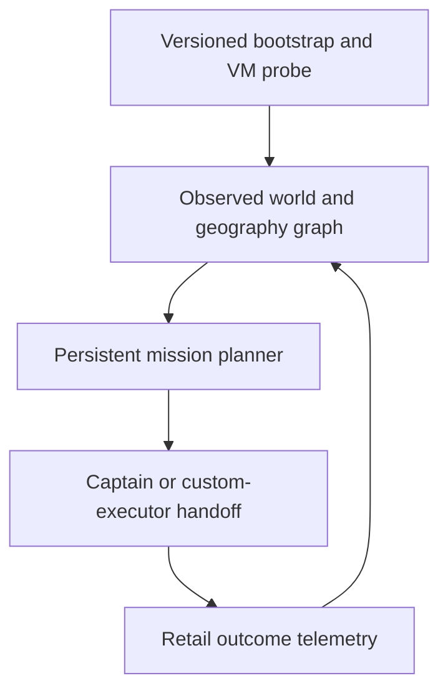

# Executive synthesis — Warcraft III *Fall of Rome* AI research

Research date: 2026-08-10  
Scope note: the supplied document calls itself “seven” briefs but contains **eight**. All eight were researched.

## Bottom line

Use a **hybrid architecture with explicit ownership boundaries**:

- the custom planner should own geography, objectives, partial-observability state, alliances, siege/transport prerequisites, commitment, and recovery;
- Warcraft III's engine AI/captains may serve as a coarse local execution service after an explicit handoff, but should not own the strategic campaign;
- every AI-VM/native dependency must sit behind a version-tested adapter and liveness check;
- evaluate play in the real retail client with explicit map-emitted outcome events before adding more heuristics.

This is not a theoretical preference. The source audits found all of the following:

- the AI VM exposes less than `common.j` declares, fails silently in important cases, and has no credible exhaustive compatibility table;
- captains allocate by unit type/count rather than exact handles, hide path/combat state, and conflict with competing orders;
- AMAI spends substantial code on guard/captain arbitration and still records recurring target, retreat, pathing, transport, and coordination defects;
- AMAI's army tracker is not the clean motion model described in the prompt: its “velocity” is one-sample displacement, its projection appears to mix a point with a vector, and two further source-index/control-flow defects should be resolved before reuse;
- a normal `.w3g` does not record authoritative computer-AI outcomes, while upstream Warsmash does not implement the native `.ai` / `common.ai` subsystem this project needs.

The programme should therefore optimize for **observable, recoverable execution**, not for handing progressively more authority to an opaque subsystem.

## Recommended system boundary

### 1. Bootstrap and AI-VM adapter

Model startup as explicit states:

`BOT_DISABLED → CONTROLLER_COMPUTER → AI_START_REQUESTED → VM_READY → CAPTAIN_READY`

- Set or verify `MAP_CONTROL_COMPUTER` before `StartMeleeAI`/`StartCampaignAI`.
- Start one exact, build-verified archive path. There is no `SetPlayerAIScript`, `.w3i` AI-script field, or magic `map.ai` convention; `map.ai` is only the GUI placeholder.
- Exchange map→AI messages through a small, versioned `CommandAI` protocol.
- Use a dedicated shared unit as the conservative AI→map mailbox; globals are not shared and there is no symmetric reverse queue.
- Require ready/heartbeat/last-command signals. `Start*AI` returns no acknowledgement, and runtime faults may simply stop a thread.
- Maintain a per-engine-line capability matrix. Do not use `I2S`; isolate untested string-returning natives, callback enumeration, triggers, and cross-VM tricks.

### 2. Strategic world model

Represent the scenario as a dynamic graph:

- nodes: cities, control points, staging regions, ports, islands, and sea zones;
- edges/actions: open crossing, friendly gate/open, hostile gate/breach, embark/sail/disembark;
- state: ownership, known gate condition, route exposure, travel time, required siege/transport, congestion, and observation timestamp.

Use influence/threat fields to price danger along feasible routes, not to replace graph reachability. Keep observed, last-seen, inferred, and unknown enemy state separate. A fair AI must not fill this model from omniscient engine enumeration.

### 3. Persistent missions rather than tick-wise target choice

Separate the selector from the executor:

1. filter infeasible objectives;
2. score objective benefit, route cost, expected loss, prerequisites, opportunity cost, and switching cost;
3. select with true hysteresis;
4. execute phases such as `CLAIM → MUSTER → ROUTE → BREACH/EMBARK → OCCUPY → HOLD/RECOVER`;
5. record a phase-specific progress metric and abort on a typed broken assumption.

“Re-score timer fired” is not a valid interrupt. Useful interrupts include route invalidation, siege/transport loss, force below minimum, material emergency, objective-value change, and no progress toward a waypoint/gate/capture within a calibrated budget.

### 4. One intended order authority per unit

Treat unit ownership as a map-side responsibility state, not as an engine-enforced handle lease:

`ENGINE_CAPTAIN | CUSTOM_MISSION | CINEMATIC`

- Captains receive requested unit types/counts and a delimited phase, not exact handles or strategic ownership.
- Trigger and captain loops must not continuously counter-order the same units.
- Remove/recycle guard positions as part of the handoff for eligible preplaced units; remember that the shipped help excludes heroes and peon-type units.
- Strict isolation of trained units requires type/player partitioning or whole-AI pause; map-side state alone cannot stop a captain from selecting an otherwise eligible handle.
- Log requested type/count, observed selected handles, authority transitions, target, captain flags, last order source, guard changes, and distance progress.
- Keep a custom fallback for engine routines that hang, return home, lose commitment, or hit patch/map-size incompatibilities.

### 5. Team coordination without information leakage

Use one centralized contract ledger **per current team/alliance**, not one global faction ledger. Each claim records task, owner/coalition, role, promised force, ETA, phase, last progress, expiry, and dependencies. Populate it only from information the team may legally share.

Temporary alliances need explicit lifecycle behavior: join/create on activation; provenance-tag shared observations; stop sharing and revoke cross-alliance claims on expiry; apply a deliberate memory policy rather than accidentally retaining omniscient state.

### 6. Evaluation before further tuning

The immediate outcome harness should use the retail client:

1. self-start a versioned map build;
2. run an unattended match under a unique run ID/seed;
3. emit sparse semantic events;
4. archive replay, event record, build hashes, seed, exit status, and crash evidence;
5. distinguish gameplay loss from start failure, timeout, crash, missing finish, or truncated telemetry.

Minimum events include `run_started`, `objective_chosen`, `army_exit`, `region_entered`, `objective_progress`, `control_changed`, `gate_changed`, `embark`, `disembark`, `alliance_changed`, `hero_died`, and `run_finished`.

There is a direct controller mismatch to resolve: native `.ai` requires each bot slot to be `MAP_CONTROL_COMPUTER`, while the stock W3MMD reference elects an emitter only from playing `MAP_CONTROL_USER` slots. Therefore reserve a dedicated user observer if the map/player layout permits it, or validate a controlled emitter modification/local log channel. This is a release gate: first require an all-bot smoke run whose parsed output contains a known start event, counter, and end event.

## Decisions by brief

| Brief | Defensible conclusion | Programme decision |
|---|---|---|
| [1 — AI VM](brief-01-ai-vm.md) | No exhaustive public implemented-native table was found; declarations do not guarantee runtime behavior. `common.j + common.ai + user .ai` is loaded, not `Blizzard.j`; `I2S` is unsafe and failures vary by version/context. | Build a tested allowlist, compatibility prelude, heartbeat, and per-version probes. |
| [2 — custom-map AI](brief-02-custom-map-ai.md) | The computer-controller requirement is documented; a non-melee map is supported. Assignment is explicit `Start*AI(path)`. `CommandAI` is map→AI only; shared objects provide the demonstrated reverse channel. | Make bootstrap, packaging manifest, command protocol, mailbox, and explicit responsibility states/handoffs first-class subsystems. |
| [3 — captains](brief-03-captains.md) | Public captain formation is type/count based; exact membership, priorities, pathing and state thresholds are hidden. Guard positions can reserve eligible preplaced non-Hero/non-peon units for AI guard duties, but exact captain exclusion remains unknown; AMAI repeatedly removes/recycles posts around manual control. | Use captains only as coarse executors behind an explicit handoff and independent progress watchdog; use partitioning or pause when strict isolation is required. |
| [4 — AMAI](brief-04-amai.md) | AMAI is a multi-threaded, table-generated hybrid over Blizzard natives, not one periodic tick. Its tracker formula is partly verified but contains apparent source defects and omniscient enumeration; it is melee-schema driven. | Borrow scheduling, table generation, strength categories, persistence, and hardening patterns—not the tracker or top-level world model verbatim. |
| [5 — territory AI](brief-05-rts-design.md) | Strongest design is a graph-and-field hybrid with persistent phase execution, explicit siege/transport route actions, choke staging, and progress-triggered replanning. | Replace score-every-tick plus dwell with selector + mission executor; build geography and crossing diagnostics first. |
| [6 — difficulty](brief-06-difficulty.md) | Scene-wide prevalence of cheating is unmeasured. Named examples use material/information advantages, while AMAI also varies uncertainty, features, targeting, and tempo. No universal cheat-to-skill curve or verified “vision is most resented” ranking was found. | Separate `SkillProfile` from disclosed `HandicapProfile`; build the strongest fair AI first and calibrate against human strata. |
| [7 — human play](brief-07-fall-of-rome.md) | The public strategy corpus is too thin for an expert-play decomposition. No public replay set, opening/faction guide, tier list, tournament record, or substantive discussion was found. | Treat all opening/naval/alliance thresholds as hypotheses. Collect versioned replays and structured explanations from the map community. |
| [8 — outcome harness](brief-08-headless-evaluation.md) | No ready faithful headless runner was found. Warsmash is tickable but lacks the native AI subsystem; its README supports assets only through 1.32 and excludes 1.33+, while this map recommends Reforged 2.00. Raw replays omit computer actions and outcome state. | Build retail automation plus map-emitted telemetry now. Consider a bounded Warsmash spike only if retail throughput becomes the measured bottleneck. |

## Corrections to the starting assumptions

1. **The AI controller rule is not entirely undocumented.** World Editor help says the start actions are for computer-controlled slots. The novel part appears to be the demonstrated runtime conversion of a user-configured slot immediately before `Start*AI`.
2. **`RemoveGuardPosition` was not omitted from old `common.ai`.** It belongs to the map-side `common.j` interface; treating its absence from `common.ai` as a version difference is a category error.
3. **The AMAI tracker description was partly right but unsafe to copy.** Radius 1500, centroids, displacement, and town-threat distance scoring exist; “velocity” and multi-tick prediction do not, and current source contains three apparent defects.
4. **“Hard means resource cheating” is too broad.** Material bonuses are prominent in named maps, but AMAI varies several competence and information mechanisms. Prevalence across the custom-map archive is unknown.
5. **“No geographic WC3 AI exists” is too absolute.** Brytenwalda and TrueWargame document territorial AIs. What remains absent is a reusable, public, benchmarked system shown to handle arbitrary chokepoints, sieges, naval transport, and coordination competently.
6. **A replay is not a free outcome database.** It is principally an input schedule; AI-only world outcomes require map telemetry or faithful re-simulation.
7. **Warsmash is not one wrapper away.** Upstream lacks the exact native AI layer being evaluated, its documented asset support stops before Reforged-era 1.33+, and no published quantitative conformance study against retail was found for the relevant systems.

## Implementation order

1. **Capability and bootstrap probes:** per-version native matrix, exact script manifest, VM/captain readiness, heartbeat, command queue, unit mailbox.
2. **Outcome telemetry:** event schema, all-computer emission smoke test, parser, retail runner, failure classification, artifact archive.
3. **Geography model:** regions/gates/ports/control points, dynamic edge state, route feasibility/cost, diagnostics.
4. **Persistent mission executor:** phases, explicit prerequisites, hysteresis, typed progress failure, clean abort/recovery.
5. **Ownership arbitration:** captain/custom responsibility states, guard lifecycle, type/player partitioning or pause for strict isolation, hero/worker exceptions, and order-source logging.
6. **Matched experiments:** compare captain versus custom execution on preplaced/trained units, open/closed gates, siege/no siege, land/transport, pathable/unpathable goals, and each target native/version.
7. **Human evidence:** request exact-version replays and decision explanations; encode new claims as named hypotheses, then test them prospectively.
8. **Difficulty calibration:** freeze the fair Expert build, derive bounded lower-skill profiles, then estimate any disclosed handicap separately by human skill band.

## Stop rules

- Do not add a native to the production allowlist because it compiles or appears in `common.j`; require a runtime probe that records value, thread survival, and process survival.
- Do not declare captain success from `CaptainAtGoal` or failure from `CaptainIsHome` alone; require mission-level progress/outcome events.
- Do not copy an AMAI constant or formula without validating its source context and fixing the three identified tracker defects.
- Do not hard-code “expert” *Fall of Rome* openings from the current public evidence.
- Do not commit to a Warsmash production fork until a bounded spike executes a representative `.ai` through the required natives and matches retail traces within explicit tolerances.
- Do not merge difficulty and handicap in data, UI, telemetry, or evaluation.

## High-value unknowns to close experimentally

- The current-Reforged AI-VM behavior of still-unknown natives such as `R2S`, `R2SW`, `S2I`, `TriggerSleepAction`, and repeated thread/start behavior.
- Exact captain membership priority, state thresholds, fog behavior, path-failure behavior, and interaction with manual orders.
- Whether W3MMD/custom game-cache messages survive and parse in the chosen all-computer local configuration.
- Retail repeatability for matched seeds and the effect of windowing/minimizing/VM execution on timing.
- The actual 1.06 player meta for expansion versus capital rush, naval transport versus naval combat, temporary alliances, faction counters, and city-abandon thresholds.
- Whether the engine captain or a custom executor produces better mission completion, casualties, hero survival, gate/transport handling, and order stability on this map.

## Evidence boundary

Every detailed report labels documented artifacts, source inference, runtime experiments, community reports, negative searches, and unknowns separately. No absence-of-search result is treated as proof that private code, Discord knowledge, or undocumented engine behavior cannot exist. Planning recommendations and effort estimates are explicitly not presented as published facts.
